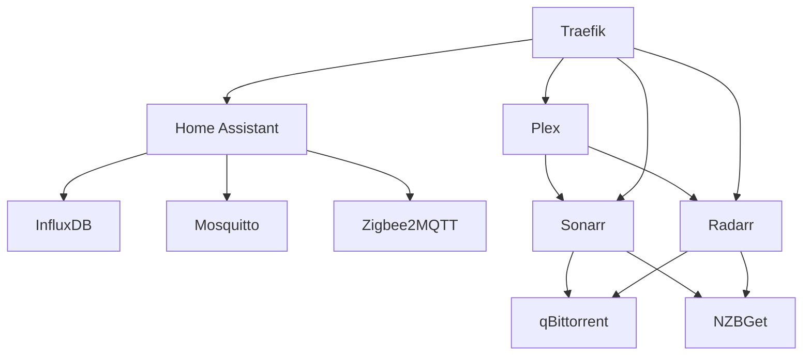

# Docker Services Overview

This repository manages multiple Docker services for a local server, organized into logical stacks with comprehensive profile support.

## Service Stacks

### 1. Infrastructure Stack (`docker-compose-infra.yml`)
**Profiles**: `infra`, `proxy`, `core`, `management`, `dashboard`, `network`

- **Traefik**: Reverse proxy and load balancer (v3.0)
- **Portainer**: Docker management UI (`infra`, `management`)
- **Dashy**: Dashboard/organization tool (`infra`, `dashboard`)
- **Pi-hole**: Network-wide ad blocking (`infra`)
- **Omada**: Network controller (`network`)

### 2. Home Automation Stack (`docker-compose-domotica.yml`)
**Profiles**: `domotica`, `iot`, `database`, `mqtt`

- **Home Assistant**: Home automation platform (`domotica`, `iot`)
- **InfluxDB**: Time-series database (`domotica`, `database`)
- **Mosquitto**: MQTT broker (`domotica`, `mqtt`)
- **Zigbee2MQTT**: Zigbee device bridge (`domotica`)

### 3. Media Management Stack (`docker-compose-arr.yml`)
**Profiles**: `media`, `arr`

- **Sonarr**: TV show management
- **Radarr**: Movie management
- **Bazarr**: Subtitle management
- **Readarr**: E-book management

### 4. Media Services Stack (`docker-compose-media.yml`)
**Profiles**: `media`, `streaming`, `books`, `torrent`

- **Plex**: Media server (`media`, `streaming`)
- **Jellyfin**: Alternative media server (`media`, `streaming`)
- **Calibre**: E-book library management (`media`, `books`)
- **Calibre-Web**: Web interface for Calibre (`media`, `books`)
- **NZBGet**: Usenet downloader (`media`)
- **qBittorrent**: Torrent client (`media`, `torrent`)

### 5. Security Stack (`docker-compose-frigate.yml`)
**Profiles**: `frigate`

- **Frigate**: NVR with AI object detection

### 6. System Services (`docker-compose.yml`)
**Profiles**: `system`, `updates`

- **Watchtower**: Automatic container updates

## Profile-Based Management

### Available Profiles

| Profile | Description | Services |
|---------|-------------|----------|
| `infra` | Core infrastructure | Traefik, Portainer, Dashy, Pi-hole |
| `domotica` | Home automation | Home Assistant, InfluxDB, Mosquitto, Zigbee2MQTT |
| `media` | Media services | Plex, Jellyfin, Calibre, qBittorrent, NZBGet, *arr |
| `arr` | Media management | Sonarr, Radarr, Bazarr, Readarr |
| `frigate` | Security | Frigate |
| `system` | System services | Watchtower |

### Additional Profiles

| Profile | Description | Services |
|---------|-------------|----------|
| `iot` | IoT devices | Home Assistant |
| `database` | Databases | InfluxDB |
| `mqtt` | MQTT broker | Mosquitto |
| `streaming` | Media streaming | Plex, Jellyfin |
| `books` | E-book management | Calibre, Calibre-Web |
| `torrent` | Torrent client | qBittorrent |
| `proxy` | Reverse proxy | Traefik |
| `management` | Management tools | Portainer |
| `dashboard` | Dashboards | Dashy |
| `updates` | Update services | Watchtower |

## Architecture

```
├── docker-compose.yml              # Main (system services)
├── docker-compose-infra.yml        # Infrastructure stack
├── docker-compose-domotica.yml     # Home automation stack
├── docker-compose-media.yml        # Media services stack
├── docker-compose-arr.yml          # Media management stack
├── docker-compose-frigate.yml      # Security stack
└── config/                         # Service configurations
    ├── arr/                        # *arr services
    ├── media/                     # Media services
    ├── domotica/                  # Home automation
    ├── network/                   # Network services
    └── monitoring/                # Monitoring tools
```

## Key Features

- **Modular Stacks**: Services organized into logical stacks
- **Profile-Based Deployment**: Start specific service groups
- **Centralized Configuration**: Standardized `.env` variables
- **Persistent Storage**: Volumes for data persistence
- **Networking**: Traefik handles routing with host-based rules
- **Security**: Pi-hole for DNS filtering, Frigate for surveillance
- **Automation**: Home Assistant with Zigbee2MQTT integration
- **Backup System**: Automated configuration backups

## Usage Examples

### Start Specific Stacks

```bash
# Start infrastructure only
docker compose --profile infra --profile proxy --profile management up -d

# Start home automation stack
docker compose --profile domotica --profile iot --profile database --profile mqtt up -d

# Start media services
docker compose --profile media --profile streaming --profile arr up -d

# Start everything
docker compose up -d
```

### Update Specific Stacks

```bash
# Update arr services only
docker compose -f docker-compose-arr.yml pull
docker compose -f docker-compose-arr.yml up -d

# Update home automation stack
docker compose -f docker-compose-domotica.yml pull
docker compose -f docker-compose-domotica.yml up -d
```

### Backup Configuration

```bash
# Backup Home Assistant
./scripts/backup_homeassistant.sh

# Backup all configurations (manual)
tar -czvf backup_config_$(date +%Y%m%d).tar.gz config/
```

## Profile Combinations

### Common Use Cases

| Use Case | Command |
|----------|---------|
| **Full Home Setup** | `docker compose up -d` |
| **Media Center Only** | `docker compose --profile media --profile arr --profile streaming up -d` |
| **Home Automation Only** | `docker compose --profile domotica up -d` |
| **Infrastructure Only** | `docker compose --profile infra up -d` |
| **Development/Testing** | `docker compose --profile domotica --profile media up -d` |

## Configuration Management

### Environment Variables

All services use centralized `.env` variables:

```env
# User IDs
PUID=1000
PGID=1000

# Timezone
TZ=Europe/Brussels

# Media Paths
MEDIA_PATH_1=/media/external/data
MEDIA_PATH_2=/media/external2/media

# Database credentials
INFLUXDB_USER=homeassistant
INFLUXDB_PASSWORD=password
INFLUXDB_ORG=home
INFLUXDB_BUCKET=homeassistant
```

### Configuration Structure

```
config/
├── arr/          # Sonarr, Radarr, Bazarr, Readarr
├── media/        # Plex, Jellyfin, Calibre, etc.
├── domotica/     # Home Assistant, InfluxDB, Mosquitto
├── network/      # Pi-hole, Omada
└── monitoring/   # Future monitoring services
```

## Backup Strategy

- **Location**: `/media/external2/backups/`
- **Retention**: 30 days automatic cleanup
- **Scripts**: Stack-specific backup scripts in `scripts/`
- **Exclusions**: Cache files, logs, temporary data

## Service Dependencies



## Maintenance

### Update All Services

```bash
# Pull latest images
docker compose pull

# Recreate containers
docker compose up -d --remove-orphans

# Clean up
docker system prune -f
```

### Monitor Services

```bash
# View logs
docker compose logs -f

# Check status
docker compose ps

# View resource usage
docker stats
```

## Best Practices

1. **Use Profiles**: Start only needed services
2. **Regular Backups**: Use provided backup scripts
3. **Monitor Updates**: Watchtower handles automatic updates
4. **Check Logs**: Monitor service health regularly
5. **Resource Limits**: Consider adding resource constraints
6. **Security**: Keep services updated and use strong passwords

## Troubleshooting

### Common Issues

**Service won't start**:
```bash
docker compose logs <service_name>
docker compose restart <service_name>
```

**Profile not found**:
```bash
docker compose config --profiles
```

**Permission issues**:
```bash
chown -R ${PUID}:${PGID} config/
```

## Future Enhancements

- Add monitoring stack (Prometheus, Grafana)
- Implement centralized logging
- Add notification services
- Expand backup coverage to all services
- Add health checks to remaining services